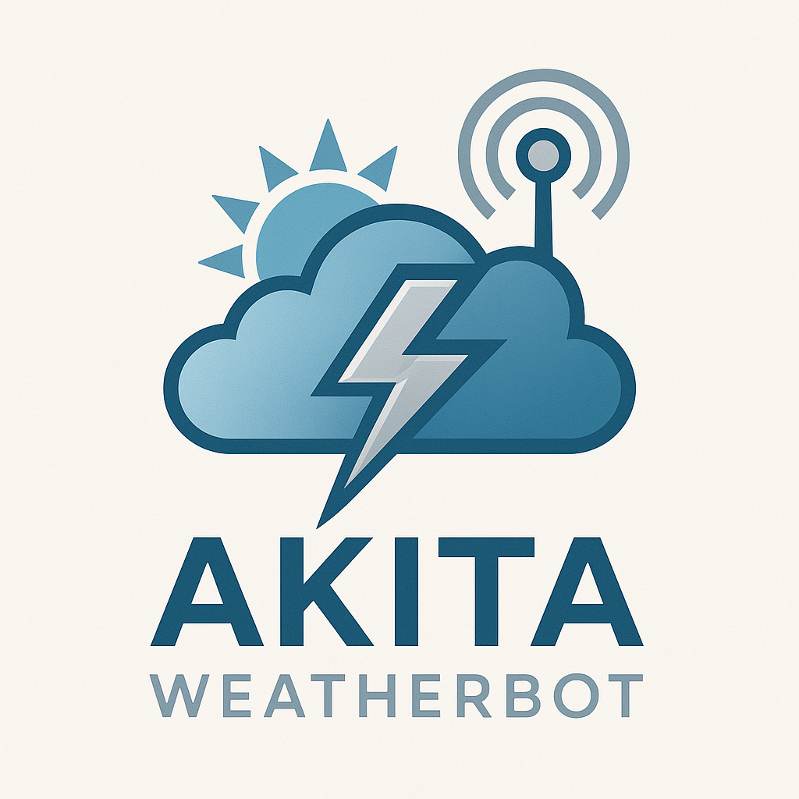
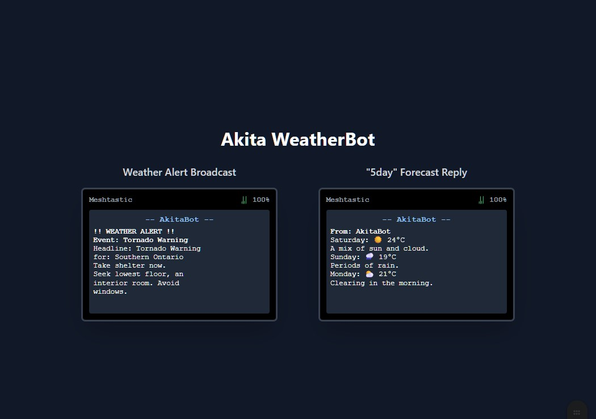

# Akita WeatherBot

A weather bot with alerts and forecasts for Canadian Meshtastic users, licensed under the GPLv3. Designed to run on a Raspberry Pi or any computer with a connected Meshtastic device.




## Our Mission

- To provide accurate Canadian weather forecasts via the mesh.
- To provide ECCC Public Weather Alerts anywhere, including locations that don't receive Weatheradio Canada broadcasts.
- To allow simple customization to better suit your deployment.
- To be lightweight, efficient, and open-source.

## Features

- Utilizes Environment and Climate Change Canada (ECCC), the official source for Canadian weather data and alerts.
- Automatically broadcasts new, severe weather alerts to the mesh network.
- **Weather Forecasts:** A selection of multi-day and hourly forecasts available on demand.
- **Network Diagnostics:** Get details on your connection to the bot.
- **Auto-Reboot:** Optional daily reboot function to improve node stability.
- **Configurable** single-message or multi-message replies to suit network traffic.

## Bot Interaction

Direct Message (DM) your bot's node with any of the following commands:

- `?` : Receive a menu of all available weather commands.
- `hourly` : 24-hour hourly forecast with temp, POP, and conditions. *(Multi-message)*
- `5day` : 5-day detailed forecast. *(Multi-message)*
- `7day` : 7-day forecast in emoji form. *(Multi-message)*
- `4day` : 4-day simple forecast in emoji form. *(Single message)*
- `2day` : Today and tomorrow's detailed forecast. *(Single message)*
- `rain` : Chance of precipitation every hour for the next 24 hours. *(Single message)*
- `temp` : Predicted temperature every hour for the next 24 hours. *(Single message)*
- `alert-status` : Runs a check on the ECCC alert system.
- `test` : Bot will return a simple acknowledgement.
- `tst-detail` : Returns an acknowledgement with connection details (RSSI, SNR).
- `advertise` : Bot sends its menu on the public channel.

### Screenshot




## Requirements

- Python 3.11 or above  
- Access to a Meshtastic device  
- Serial Drivers for your Meshtastic device  
- An internet connection for the bot  

## Installation

Clone this repository:

```bash
git clone https://github.com/AkitaEngineering/Akita-WeatherBot.git
```

Navigate into the folder:
```bash
cd Akita-WeatherBot
```

Setup and activate a virtual environment (examples):

# Create the venv
```bash
python -m venv .venv
```

# Activate - Linux / macOS
```bash
source .venv/bin/activate
```

# Activate - Windows PowerShell
```powershell
. .\.venv\Scripts\Activate.ps1
```

# Activate - Windows cmd.exe
```cmd
. .\.venv\Scripts\activate.bat
```

Install the required dependencies:
```bash
pip install -r requirements.txt
```

Connect your Meshtastic device to your computer via USB.
**Crucially, edit the `settings_canada.yaml` file to configure your location.**

---

### How to Run

Run the bot using the appropriate port or host option for your Meshtastic device.

Linux / macOS (example):
```bash
python akitabot.py --port /dev/ttyUSB0
```

Windows (example, PowerShell):
```powershell
python akitabot.py --port COM7
```

Using TCP (if your node is on your network):
```bash
python akitabot.py --host meshtastic.local
```

---

### Configuration (`settings_canada.yaml`)
This file is the heart of your bot's configuration.

* `ECCC_LOCATION_CODE`: The site code for your specific forecast location.
* `ALERT_PROVINCE_CODE`: The two-letter code for your province (e.g., ON, BC, QC).
* `MYNODES`: A list of Node IDs (e.g., `['!c4b787a0', '!a1b2c3d4']`) that are allowed to use the bot when the `FIREWALL` is enabled.
* `USER_AGENT_APP` / `USER_AGENT_EMAIL`: **Highly recommended** you set these to unique values. This identifies your bot to ECCC and is good practice.

#### How to get your `ECCC_LOCATION_CODE`:
1.  Go to [https://weather.gc.ca/](https://weather.gc.ca/).
2.  Search for your city or town (e.g., "Welland").
3.  On the city's forecast page, look at the URL. It will be something like:
    `.../city/pages/on-81_metric_e.html`
4.  Now, construct a new URL to find the official site code:
    `https://dd.weather.gc.ca/citypage_weather/xml/ON/` (replace `ON` with your province code).
5.  Browse this directory for the file corresponding to your city. For Welland, it is `s0000670_e.xml`.
6.  Your `ECCC_LOCATION_CODE` is the part before `_e.xml`, so for Welland, it is `s0000670`.
    Enter this into the settings file.

---
### License
This project is distributed under the **GNU General Public License v3.0**. See the `LICENSE` file for the full text.

---
## Documentation

Extended docs and quickstart instructions are available in the `docs/` folder:

- `docs/QUICKSTART.md` — minimal setup and run steps for local testing.
- `docs/EXAMPLES.md` — example commands and sample outputs.
- `docs/TROUBLESHOOTING.md` — common issues and fixes.

Refer to the `Deployment Guide - Akita WeatherBot` for `systemd`-based production deployments on Linux.

Start here: `docs/index.md` for a single place to find the quickstart, examples, and troubleshooting.
